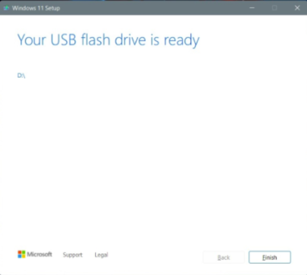

# Dev_Setup
Setup Development Environment

#Assignment: Setting Up Your Developer Environment

#Objective:
This assignment aims to familiarize you with the tools and configurations necessary to set up an efficient developer environment for software engineering projects. Completing this assignment will give you the skills required to set up a robust and productive workspace conducive to coding, debugging, version control, and collaboration.

#Tasks:

1. Select Your Operating System (OS):
   Choose an operating system that best suits your preferences and project requirements. Download and Install Windows 11. https://www.microsoft.com/software-download/windows11
   Step 1: Agree to the terms and choose Accept. Let the Setup tool run, and choose Use the recommended options for this PC. Click Next, and choose USB flash drive. 
   Step 2: Choose your USB flash drive from the list and then click Next. You'll be prompted and Windows 11 will download to it. Once finished, the installer will switch to Creating  Installation media. You'll know when it's finished, as you'll get a prompt that the drive is ready.
   
   Step 3: Once your USB drive is ready, close the installer with the Finish button .Keep the USB drive plugged into your PC. 
   Step 4: Head back to the Windows 10 settings app, and choose Update & security. Then choose Recovery on the left side. Under Advanced startup, choose the Restart now option. 
   Step 5: In the pop-up prompt, choose Use a device. Your USB drive should appear listed. Choose it, and Windows will restart to your USB drive and Windows 11 installer.
   
   Step 6: Once in the Windows 11 installer, select a language, and click Next. Pick the version of  that matches the version of Windows 10 on your PC. and click Next. 
   Step 7: Choose the Custom option and choose the drive to install Windows 11 on. You might have to click the Format button to erase all your files on the drive. When done, select the drive again and click Next.
   
   Step 8: Windows 11 will install to your PC, and you can sit back. You'll then be taken to the out-of-box experience, and will be prompted to set up your PC again.
   

2. Install a Text Editor or Integrated Development Environment (IDE):
   Select and install a text editor or IDE suitable for your programming languages and workflow. Download and Install Visual Studio Code. https://code.visualstudio.com/Download
   Step 1.Visit https://code.visualstudio.com/Download and select “Download for Widows”. 
   
   Step 2. Wait for the download to finish and then head to downloads folder. 
   Step 3.Click on it initiate the installation process. 
   Step 4. After the installer opens,it will ask you to accept the terms and conditions of visual studio code.Click on I Accept the agreement and then click the Next button.
   
   Step 5. Choose the location data for running the vs code .It will then ask you to browse the location .Then click on the Next button.
   
   Step 6.Then it will ask to begin the installation setup .Click on the Install button.
   
   Step 7. This will take about 1 minute. 
   Step 8.After the installation setup for visual studio code is finished, it will show window below.Tick the checkbox and click Next.
   
   Step 9. Visual studio code window opens successfully .

3. Set Up Version Control System:
   Install Git and configure it on your local machine. Create a GitHub account for hosting your repositories. Initialize a Git repository for your project and make your first commit. https://github.com
   Step 1. Download the latest git for windows at https://gitforwindows.org/ 
   Step 2. After successfully starting the installer, you should see the Git setup wizard screen. Click the Next button and Finish prompts to complete the installation. 
   Step 3. Create a GitHub Account-- Visit https://github.com and sign up for a new account . 
   Step 4. Open a git bash and run the following commands to configure your Git username and email. 
   git config --global user.name "your github username"
   git config --global user.email "youremail@gmail.com" 
   Step 5. While still at the git bash, navigate to your project folder using “cd Desktop/myfolder” or create one using “mkdir project_name” then “ cd project_name” 
   Step 6. Initialize ,commit and push the repository to github using: git init git add . git commit -m “My first project” git push

4. Install Necessary Programming Languages and Runtimes:
  Instal Python from http://wwww.python.org programming language required for your project and install their respective compilers, interpreters, or runtimes. Ensure you have the necessary tools to build and execute your code.
   Step 1. Visit the official python website https://www.python.org/ to download the latest version of python.
   
   Step 2. Select the “Windows installer” option and click on the “Download” button. Once the download is complete, run the installer.heck the boxes “Use admin privileges when installing py.exe” and “Add python.exe to PATH” to save the trouble of manual adjustments in the environment variable later.
   
   Step 3. Follow the on-screen instructions during the preceding stages.Once installation is complete you should see the a message like this: 
   
   Step 4. Verify that the installation is complete using python -v on the command prompt.

5. Install Package Managers:
   If applicable, install package managers like pip (Python).
   Step 1. On the command prompt, check whether pip is installed by executing: pip –version since it comes by default after downloading python. 
   Step 2. If not you can download it using the command "python get-pip.py"

6. Configure a Database (MySQL):
   Download and install MySQL database. https://dev.mysql.com/downloads/windows/installer/5.7.html
   Step 1. Visit https://dev.mysql.com/downloads/installer/ and click on the first download button.
   
   Step 2. On the mysql Homepage, click on the “No thanks, just start my download” link to proceed mysql downloading.
   
   Step 3. After mysql downloading MySQL.exe file , go to your down loads folder , find the file and double click to run the installer.
   
   Step 4. The installer will instruct you to choose the setup type. For most users , the “Developer Default” is suitable. Click “Next” to proceed.
   
   Step 5. You will be prompted to install typical MySQL software .The installer can auto-resolve some of issues, but not in this case.
   Step 6. In the download section click, “Execute” to start downloading the content you selected.Click “Next”
   
   Step 7. Proceed to “Product configuration” > “Type and Networking” > “ Authentication Method” pages by clicking the “Next” button. 
   Step 8. Create a password for the MySQL root user.Ensure it is strong and memorable.Click Next to proceed. 
   Step 9. Connect to server: Enter the root password , click “Check” .If it says “Connection Succeed” you have successfully connected to the server. 
   Step 10. Once installation is complete , click “Finish”.
   
   Step 11. To verify installation, open MySQL command line client at your start menu and login using the root user credentials you set during installation.

7. Set Up Development Environments and Virtualization (Optional):
   Consider using virtualization tools like Docker or virtual machines to isolate project dependencies and ensure consistent environments across different machines.

8. Explore Extensions and Plugins:
   Explore available extensions, plugins, and add-ons for your chosen text editor or IDE to enhance functionality, such as syntax highlighting, linting, code formatting, and version control integration.
   To install extensions.
   Step 1. Open vs code, go to Extensions view( ctrl +shift +X). 
   Step 2. Search for your extension. Examples of extensions I installed: • Flutter files, Auto close tag, Auto complete tag, C/C++, Code runner, Dart, Django-intellisence

9. Document Your Setup:
    Create a comprehensive document outlining the steps you've taken to set up your developer environment. Include any configurations, customizations, or troubleshooting steps encountered during the process. 
Project done: https://github.com/Manassehkim/phonebook.git
Challenges faced:
   • Challenge: Compatibility issues, errors during installation.
   Solution: I Followed the official troubleshooting guide provided by Microsoft for common installation and activation issues.
   • Challenge: Network issues .
   Solution: I used a download manager to ensure the download completes successfully. 
   • Challenge: Extension conflicts or performance issues. 
   Solution: I checked  user reviews and documentation for each extension to ensure compatibility.
   • Challenge: Connection errors between my application and the MySQL database. Solution: Ensured MySQL is running and accessible on the correct port (default is 3306).

#Deliverables:
- Document detailing the setup process with step-by-step instructions and screenshots where necessary.
- A GitHub repository containing a sample project initialized with Git and any necessary configuration files (e.g., .gitignore).
- A reflection on the challenges faced during setup and strategies employed to overcome them.

#Submission:
Submit your document and GitHub repository link through the designated platform or email to the instructor by the specified deadline.

#Evaluation Criteria:**
- Completeness and accuracy of setup documentation.
- Effectiveness of version control implementation.
- Appropriateness of tools selected for the project requirements.
- Clarity of reflection on challenges and solutions encountered.
- Adherence to submission guidelines and deadlines.

Note: Feel free to reach out for clarification or assistance with any aspect of the assignment.
